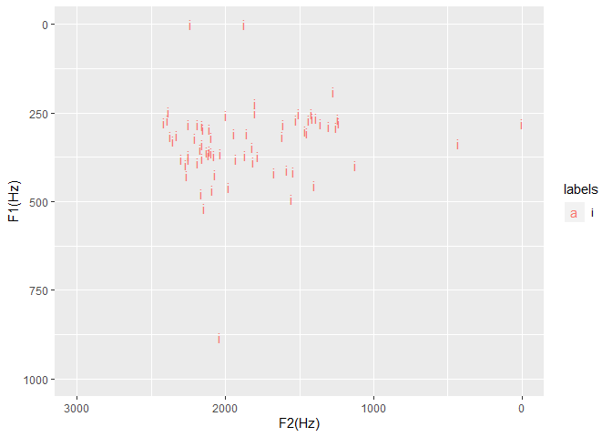

```r
# Use the special Rstudio command to permanently set the working directory
#Point working directory to a folder where there are TextGrid and wav files (usually from forced alignment)
knitr::opts_knit$set(root.dir = "C:\\Users\\Tim\\Documents\\Kera_NT\\actor_narrator_mark1_2_3_16")
```


```r
library(emuR)
```

```
## 
## Attaching package: 'emuR'
```

```
## The following object is masked from 'package:base':
## 
##     norm
```

```r
library(ggplot2)
library(dplyr)
```

```
## 
## Attaching package: 'dplyr'
```

```
## The following objects are masked from 'package:stats':
## 
##     filter, lag
```

```
## The following objects are masked from 'package:base':
## 
##     intersect, setdiff, setequal, union
```


```r
#Set up database
path2directory = file.path(getwd())
convert_TextGridCollection(path2directory, dbName = "actor", targetDir = tempdir())
```

```
## INFO: Loading TextGridCollection containing 4 file pairs...
## 
  |                                                                       
  |                                                                 |   0%
  |                                                                       
  |================                                                 |  25%
  |                                                                       
  |================================                                 |  50%
  |                                                                       
  |=================================================                |  75%
  |                                                                       
  |=================================================================| 100%
##   INFO: Rewriting 4 _annot.json files to file system...
## 
  |                                                                       
  |                                                                 |   0%
  |                                                                       
  |================                                                 |  25%
  |                                                                       
  |================================                                 |  50%
  |                                                                       
  |=================================================                |  75%
  |                                                                       
  |=================================================================| 100%
```

```r
path2db = file.path(tempdir(), "actor_emuDB")
db_handle = load_emuDB(path2db, verbose = FALSE)
autobuild_linkFromTimes(db_handle, superlevelName = "word", sublevelName = "phone", convertSuperlevel = TRUE, newLinkDefType = "ONE_TO_MANY")
```

```
##   INFO: Rewriting 4 _annot.json files to file system...
## 
  |                                                                       
  |                                                                 |   0%
  |                                                                       
  |================                                                 |  25%
  |                                                                       
  |================================                                 |  50%
  |                                                                       
  |=================================================                |  75%
  |                                                                       
  |=================================================================| 100%
```

```r
features <- read.table("big_hayes_phone_list_utf8nfc.tsv",sep="\t", header=TRUE,encoding="UTF-8")
```


```r
## define the phoneList function
phoneList <- function(type,value=NULL)
{
  # Function `phoneList`
  ## Produces a character vector of phones based on the class specified by the input which is a string
  ## Eg.  phoneList('delayed_release',-1)
  ## The following is not now a feature because Tim has taken this out: For types which are effectively boolean, value = NULL defaults to 1 (eg. phonemeList('syllabic'))
  
  #Catch bad values ----------------------------------------------------------------------
  if(!is.null(value)&&!(value %in% c(F,T,1,0,-1)))  {stop('Unrecognised \'value\' argument (should be T/F or [-1:1])')}
  if(!(type %in% colnames(features)))               {stop('\'Type\' argument not in colnames(features)')}
  
  # Generate character vector ------------------------------------------------------------
  if(!is.null(value)&is.numeric(value))
    { return(as.vector(features$BruceHayes2007[features[[type]]==value]))
    } else {stop('integer \'value\' argument required with this phoneme type')}
}
```


```r
# get a list of IPA non_high_vowels
vowels <- phoneList('syllabic',1)
non_high_phones <- phoneList('high',-1)
non_high_vowel_intersection <- intersect(vowels, non_high_phones)
```


```r
# define an EMU label group called non_high_vowel
add_attrDefLabelGroup(db_handle,levelName = "phone",attributeDefinitionName = "phone",labelGroupName = "non_high_vowel", labelGroupValues = non_high_vowel_intersection)
```


```r
# This section finds all the high vowel harmony words.
# First get words with a non high vowel
words_with_non_high_vowel <- query(db_handle, query = "[word =~ .* ^ phone == non_high_vowel]")
# then take them away from the rest of the words, leaving only words with high_vowels (and periods of silence)
all_words <- query(db_handle,query = "[word =~ .*]")
words_without_non_high_vowels <- setdiff(all_words,words_with_non_high_vowel)
#remove those empty words that correspond to periods of silence
high_vowel_harmony_words <- words_without_non_high_vowels[words_without_non_high_vowels$labels!="", ]
```


```r
#Get a big list of all corresponding phones for those high vowel harmony words - you'll get a warning that it's bigger list
high_vowel_harmony_phones <- requery_hier(db_handle,seglist = high_vowel_harmony_words, level = "phone", collapse = FALSE)
```

```
## Warning in requery_hier(db_handle, seglist = high_vowel_harmony_words,
## level = "phone", : Length of requery segment list (2542) differs from input
## list (788)!
```


```r
# get all the i vowels that were found in the vowel height harmony domain 
i_vowel_harmony_words <- high_vowel_harmony_phones[high_vowel_harmony_phones$labels=="i", ]
i_long_vowel_harmony_words <- high_vowel_harmony_phones[high_vowel_harmony_phones$labels=="iː", ]
# put them both together
i_all_vowel_harmony_words <- rbind(i_vowel_harmony_words, i_long_vowel_harmony_words)
# just extract the short ones
short_i_all_vowel_harmony_words <- i_all_vowel_harmony_words[((i_all_vowel_harmony_words$end - i_all_vowel_harmony_words$start) < 50), ]
seglist_in <- short_i_all_vowel_harmony_words
```


```r
# calculate formants
trackdata = get_trackdata(db_handle,
                          seglist = seglist_in,
                          onTheFlyFunctionName = "forest",
                          resultType = "tibble",
                          verbose = F)
# get midpoint of trackdata so we just use the formant values at the midpoint
trackdata_norm=normalize_length(trackdata)
trackdata_norm_midpoint = trackdata_norm %>% filter(times_norm > 0.49 & times_norm < 0.51)
# check size - this should match the number of records in seglist_in
dim(trackdata_norm_midpoint)
```

```
## [1] 70 24
```


```r
#print out statistical summary (I'm most interested in T1 and T2 which corresponds to F1 and F2)
summary(trackdata_norm_midpoint)
```

```
##    sl_rowIdx        labels              start             end        
##  Min.   : 1.00   Length:70          Min.   :  5315   Min.   :  5345  
##  1st Qu.:18.25   Class :character   1st Qu.: 65883   1st Qu.: 65913  
##  Median :35.50   Mode  :character   Median :147790   Median :147825  
##  Mean   :35.50                      Mean   :171794   Mean   :171828  
##  3rd Qu.:52.75                      3rd Qu.:273813   3rd Qu.:273851  
##  Max.   :70.00                      Max.   :487923   Max.   :487953  
##    db_uuid            session             bundle          start_item_id   
##  Length:70          Length:70          Length:70          Min.   : 263.0  
##  Class :character   Class :character   Class :character   1st Qu.: 823.5  
##  Mode  :character   Mode  :character   Mode  :character   Median :1474.5  
##                                                           Mean   :1703.0  
##                                                           3rd Qu.:2526.8  
##                                                           Max.   :4044.0  
##   end_item_id        level            attribute         start_item_seq_idx
##  Min.   : 263.0   Length:70          Length:70          Min.   :  23.0    
##  1st Qu.: 823.5   Class :character   Class :character   1st Qu.: 358.2    
##  Median :1474.5   Mode  :character   Mode  :character   Median : 814.5    
##  Mean   :1703.0                                         Mean   :1045.8    
##  3rd Qu.:2526.8                                         3rd Qu.:1643.2    
##  Max.   :4044.0                                         Max.   :3067.0    
##  end_item_seq_idx     type            sample_start        sample_end      
##  Min.   :  23.0   Length:70          Min.   :  234391   Min.   :  235713  
##  1st Qu.: 358.2   Class :character   1st Qu.: 2905429   1st Qu.: 2906750  
##  Median : 814.5   Mode  :character   Median : 6517539   Median : 6519081  
##  Mean   :1045.8                      Mean   : 7576098   Mean   : 7577621  
##  3rd Qu.:1643.2                      3rd Qu.:12075164   3rd Qu.:12076816  
##  Max.   :3067.0                      Max.   :21517404   Max.   :21518726  
##   sample_rate      times_orig       times_rel       times_norm 
##  Min.   :44100   Min.   :  5330   Min.   :14.99   Min.   :0.5  
##  1st Qu.:44100   1st Qu.: 65898   1st Qu.:15.00   1st Qu.:0.5  
##  Median :44100   Median :147808   Median :15.00   Median :0.5  
##  Mean   :44100   Mean   :171811   Mean   :17.29   Mean   :0.5  
##  3rd Qu.:44100   3rd Qu.:273832   3rd Qu.:20.00   3rd Qu.:0.5  
##  Max.   :44100   Max.   :487938   Max.   :25.00   Max.   :0.5  
##        T1              T2             T3             T4      
##  Min.   :  0.0   Min.   :   0   Min.   :   0   Min.   :   0  
##  1st Qu.:279.6   1st Qu.:1525   1st Qu.:2524   1st Qu.:3554  
##  Median :319.2   Median :1986   Median :2568   Median :3735  
##  Mean   :334.3   Mean   :1840   Mean   :2586   Mean   :3518  
##  3rd Qu.:378.5   3rd Qu.:2159   3rd Qu.:2658   3rd Qu.:3832  
##  Max.   :883.5   Max.   :2410   Max.   :3156   Max.   :4047
```


```r
#Plot on a formant chart
trackdata_norm_midpoint %>%
    filter((end - start)>0) %>%
    ggplot(aes(x=T2,y=T1,color=labels))+
    geom_text(aes(label = labels))+
    xlim(3000, 0)+ylim(1000,0)+xlab("F2(Hz)")+ylab("F1(Hz)")
```

<!-- -->

