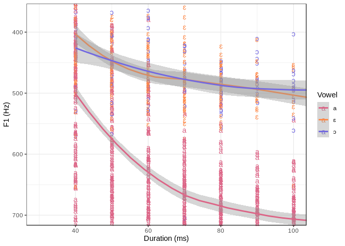
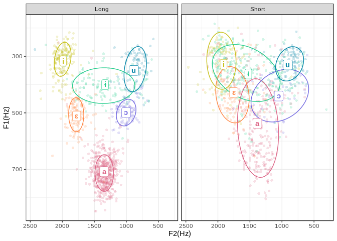

This is the code that is used to produce Figre 2 (p6) Figure 3 (p7) in the paper [Corpus Phonetics for Under Documented Languages](http://journals.linguisticsociety.org/proceedings/index.php/amphonology/article/view/4682/4312). It uses data produced by the notebook "extract_kera_vowel_data".

```r
# Point working directory to a folder containing the vowel data
knitr::opts_knit$set(root.dir = "/home/tim/Downloads/speakerAF_mark1_2_3_4_14_16")
```


```r
library(ggplot2)
library(plotly)
library(dplyr)
library(readr)
library(stringr)
```

Load in list of loan words


```r
loan_words_tbl <- read_tsv("loan_words_to_exclude.txt")
loan_words <- pull(loan_words_tbl,loan_word)
loan_words
```

```
##  [1] "yeesu"      "zeruzalem"  "simoŋ"      "iskariyoti" "ziwifiŋa"  
##  [6] "dəmasiŋa"   "farisiyeŋ"  "matiye"     "nazareti"   "sidoŋaŋ"   
## [11] "zudasi"     "puranul"    "piyer"      "zaŋ"        "zaki"      
## [16] "galile"     "galileŋ"    "yeesuŋ"     "sataŋ"      "mari"      
## [21] "levi"       "alfeŋ"      "zurdeŋa"    "zebedeŋ"    "kapernam"  
## [26] "magdalaŋ"   "nazaretiŋ"
```

Remove these loan words as well as suspicious data points (where the formant tracker failed or where we have suspected elision)


```r
invowel <- read_tsv("all_vowels_durations.tsv")
# remove all formant values that are zero (where formant tracker got confused), low energy and loan words
invowel_trimmed <- invowel %>% filter(F1 != 0) %>% filter(F2 != 0) %>% filter(RMS > 60) %>% filter(!(word_label %in% loan_words))
```

Merge the phonological lengths of each vowel so we focus just on vowel quality


```r
vowels_with_one_length <- invowel_trimmed %>% 
  mutate(merged_label = str_replace(labels,"ː","")) %>%  # I'd prefer to do these two lines in one step but there are
  mutate(Vowel = str_replace(merged_label,"ə","a"))      # unicode issues with str_replace_all with vectors in Windows
summary_of_merged_vowels <- vowels_with_one_length %>% count(Vowel)
```

Remove rare vowels (in practice these are usually nasalised ones)


```r
common_vowels <- vowels_with_one_length %>%
  group_by(Vowel) %>%
  filter(n() >= 10)
```

Split up the vowel length into short and long durations 


```r
invowel_long <- common_vowels %>% 
   filter((end-start) > 71)

invowel_short <- common_vowels %>% 
   filter((end-start) > 39 & (end-start) < 51  )
```

Calculate vowel centroids


```r
invowel_long_means = invowel_long %>%
  group_by(Vowel) %>%
  summarise(F1 = mean(F1), F2 = mean(F2))

invowel_short_means = invowel_short %>%
  group_by(Vowel) %>%
  summarise(F1 = mean(F1), F2 = mean(F2))
```

Assign colour scale


```r
os <- Sys.info()['sysname']
if (os=="Windows") { # R in Windows has a problem with unicode so we have to hand-tune the 
                     # order for windows and not assign the names of the unicode characters. 
                     # This should now work on Rstudio in windows but not knitr in windows
  kera_vowel_colour_scale <-
    scale_colour_manual(values=c("#7268E0","#FF8745","#27CD8D","#DC6486","#C6C018","#0084A6"))
} else {             # This should work on Linux
  kera_vowel_colour_scale <- scale_colour_manual(values=c("ɔ" = "#7268E0", "ɛ" = "#FF8745", "ɨ" = "#27CD8D", "a" = "#DC6486", "i" = "#C6C018", "u" = "#0084A6"))
}
```
Graph showing Duration against F1 for Figure 2. This graph is slightly 
different from the publication because of the different pre-processing used to
remove datapoints but the means still match within the confidence levels.

```r
common_vowels%>%
     filter(Vowel=="a"|Vowel=="ɛ"|Vowel=="ɔ") %>%
     filter((end-start) > 39 ) %>% 
     ggplot(aes(end-start,F1,colour=Vowel))+
     theme_bw() +
     geom_text(aes(label = Vowel)) + stat_smooth() + 
     coord_cartesian(ylim=c(700,370),xlim=c(30,100)) + # using coord_cartesian ensures that the data is not subsetted when zooming in (like it is with xlim, ylim on their own)
     scale_y_reverse() +
     kera_vowel_colour_scale +
     xlab("Duration (ms)")+ylab("F1 (Hz)") 
```

```
## `geom_smooth()` using method = 'loess' and formula 'y ~ x'
```

<!-- -->

Formant plot for Figure 3


```r
invowel_all <- bind_rows("Long" = invowel_long, "Short" = invowel_short, .id = "duration")
invowel_all_means <- bind_rows("Long" = invowel_long_means, "Short" = invowel_short_means, .id = "duration")
ggplot(invowel_all, aes(x = F2, y = F1, colour = Vowel, label = Vowel)) + 
    geom_point(alpha = 0.2, shape=16) + 
    stat_ellipse(level = 0.68) + # these are sample ellipses not confidence ellipses
    geom_label(data = invowel_all_means, aes(x = F2, y = F1),fontface=2) + 
    scale_x_reverse() + scale_y_reverse() + xlab("F2(Hz)")+ylab("F1(Hz)") +
    kera_vowel_colour_scale +
    facet_wrap(vars(duration))+
    theme_bw()+
    theme(legend.position = "none")
```

<!-- -->

