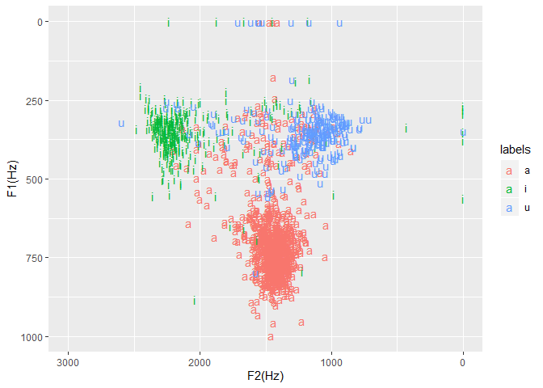

Formant plot of /i/, /u/, /a/ for the speaker
---------------------------------------------

```r
# Point working directory to a folder where there are TextGrid and wav files (usually from forced alignment)
knitr::opts_knit$set(root.dir = "C:\\Users\\Tim\\Documents\\Kera_NT\\actor_narrator_mark1_2_3_16")
```


```r
library(emuR)
```

```
## 
## Attaching package: 'emuR'
```

```
## The following object is masked from 'package:base':
## 
##     norm
```

```r
library(ggplot2)
library(dplyr)
```

```
## 
## Attaching package: 'dplyr'
```

```
## The following objects are masked from 'package:stats':
## 
##     filter, lag
```

```
## The following objects are masked from 'package:base':
## 
##     intersect, setdiff, setequal, union
```


```r
# Set up database
path2directory = file.path(getwd())
convert_TextGridCollection(path2directory, dbName = "actor", targetDir = tempdir())
```

```
## INFO: Loading TextGridCollection containing 4 file pairs...
## 
  |                                                                       
  |                                                                 |   0%
  |                                                                       
  |================                                                 |  25%
  |                                                                       
  |================================                                 |  50%
  |                                                                       
  |=================================================                |  75%
  |                                                                       
  |=================================================================| 100%
##   INFO: Rewriting 4 _annot.json files to file system...
## 
  |                                                                       
  |                                                                 |   0%
  |                                                                       
  |================                                                 |  25%
  |                                                                       
  |================================                                 |  50%
  |                                                                       
  |=================================================                |  75%
  |                                                                       
  |=================================================================| 100%
```

```r
path2db = file.path(tempdir(), "actor_emuDB")
db_handle = load_emuDB(path2db, verbose = FALSE)
# Set up word tier and phone tier
autobuild_linkFromTimes(db_handle, superlevelName = "word", sublevelName = "phone", convertSuperlevel = TRUE, newLinkDefType = "ONE_TO_MANY")
```

```
##   INFO: Rewriting 4 _annot.json files to file system...
## 
  |                                                                       
  |                                                                 |   0%
  |                                                                       
  |================                                                 |  25%
  |                                                                       
  |================================                                 |  50%
  |                                                                       
  |=================================================                |  75%
  |                                                                       
  |=================================================================| 100%
```

```r
# Extract the a, i and u vowels and put them together in a data structure, 
# and report the size - the first number is how many phones there are 
phone_a_timings <-  query(db_handle, query = "[phone == a]")
phone_i_timings <-  query(db_handle, query = "[phone == i]")
phone_u_timings <-  query(db_handle, query = "[phone == u]")
phone_vowel_timings = rbind(phone_a_timings, phone_i_timings)
phone_vowel_timings = rbind(phone_vowel_timings, phone_u_timings)
dim(phone_vowel_timings)
```

```
## [1] 1488   16
```

```r
# Calculate the formant data for the particular time segments
phone_vowel_trackdata = get_trackdata(db_handle,
                          seglist = phone_vowel_timings,
                          onTheFlyFunctionName = "forest",
                          resultType = "tibble",
                          verbose = F)
```


```r
# Get midpoint of trackdata so we just use the formant values at the midpoint
phone_vowel_trackdata_norm=normalize_length(phone_vowel_trackdata)
phone_vowel_midpoint = phone_vowel_trackdata_norm %>% filter(times_norm > 0.49 & times_norm < 0.51)
# Check size - this should match the previous size
dim(phone_vowel_midpoint)
```

```
## [1] 1488   24
```


```r
# Plot on a formant chart
phone_vowel_midpoint %>%
    filter((end - start)>0) %>%
    ggplot(aes(x=T2,y=T1,color=labels))+
    geom_text(aes(label = labels))+
    xlim(3000, 0)+ylim(1000,0)+xlab("F2(Hz)")+ylab("F1(Hz)")
```

```
## Warning: Removed 3 rows containing missing values (geom_text).
```

<!-- -->
