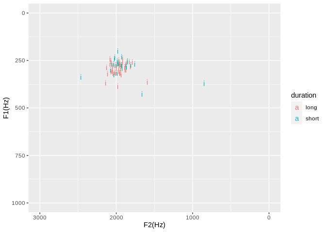

This is the code that is used for the statistical analysis in Section 3.3. in the paper [Corpus Phonetics for Under Documented Languages](http://journals.linguisticsociety.org/proceedings/index.php/amphonology/article/view/4682/4312). This particular notebook is for investigating tokens of /i/ not in the harmony domain for Speaker AF. No statistically significant difference in F1 between short
/i/ vowels and long /i/ vowels was found. A test on F2 is just added for completeness. For the other seven conditions the filenames below should be changed. 

```r
# Point working directory to a folder where there the vowel data has been saved for the particular speaker
knitr::opts_knit$set(root.dir = "/home/tim/Downloads/speakerAF_mark1_2_3_4_14_16")
```


```r
library(ggplot2)
library(plotly)
library(dplyr)
library(readr)
```

Load in list of loan words


```r
loan_words_tbl <- read_tsv("loan_words_to_exclude.txt")
loan_words <- pull(loan_words_tbl,loan_word)
loan_words
```

```
##  [1] "yeesu"      "zeruzalem"  "simoŋ"      "iskariyoti" "ziwifiŋa"  
##  [6] "dəmasiŋa"   "farisiyeŋ"  "matiye"     "nazareti"   "sidoŋaŋ"   
## [11] "zudasi"     "puranul"    "piyer"      "zaŋ"        "zaki"      
## [16] "galile"     "galileŋ"    "yeesuŋ"     "sataŋ"      "mari"      
## [21] "levi"       "alfeŋ"      "zurdeŋa"    "zebedeŋ"    "kapernam"  
## [26] "magdalaŋ"   "nazaretiŋ"
```

Remove these loan words as well as suspicious data points (where the formant tracker failed or where we have suspected elision). This particular example notebook investigates tokens of /i/ not in the harmony domain. For other vowel data, change the filename below.


```r
highvowel <- read_tsv("i_all_durations_normal.tsv") # CHANGE THIS FOR OTHER VOWEL DATA e.g. i_all_durations_harmony.tsv
# remove all formant values that are zero (where formant tracker got confused), low energy and loan words
highvowel_trimmed <- highvowel %>% filter(F1 != 0) %>% filter(F2 != 0) %>% filter(RMS > 60) %>% filter(!(word_label %in% loan_words))
highvowel_long <- highvowel_trimmed %>% 
   filter((end-start) > 71) # the reason this numbers are not round numbers is because earlier floating point 
highvowel_short <- highvowel_trimmed %>% # arithmetic was not rounded
   filter((end-start) > 39 & (end-start) < 51  )
```

Plot the trimmed down set of tokens as an interactive formant plot. This is a visual way of checking the difference between the short and long vowels which is formalised as a statistical test below.


```r
highvowel_all <- bind_rows("long" = highvowel_long, "short" = highvowel_short, .id = "duration")
##Plot on a formant chart
p<- highvowel_all %>%
   ggplot(aes(x=F2,y=F1,color=duration,text = paste("Word:",word_label,"\nPosition in word",round(position_in_word,2)*100,"%\nFile:", bundle, "\nTime(s):",round((start+times_rel)/1000,2),"\nEnergy:",round(RMS,2))))+
   geom_text(aes(label = labels))+
   xlim(3000, 0)+ylim(1000,0)+xlab("F2(Hz)")+ylab("F1(Hz)")
p # add the following line for an interactive graph: ggplotly(p, tooltip = "text")
```

<!-- -->

List durations (in ms) of all the tokens as a sanity check for the duration categories:

Short should be durations of 30ms and 40ms 


```r
highvowel_short$end-highvowel_short$start
```

```
##  [1] 40.00 40.00 40.00 40.00 40.00 50.00 40.02 49.98 50.00 40.00 40.00 40.00
## [13] 50.00 40.00 40.00 40.00 49.98 40.00 40.00 50.00 40.00 40.00 40.00 50.00
## [25] 50.00
```

Long should be over 70 ms


```r
highvowel_long$end-highvowel_long$start
```

```
##  [1] 130.00 190.00 100.00  90.00 250.00 110.00  80.00 100.00 140.00 230.00
## [11] 159.98 120.00 150.00 139.98 100.00  90.00 100.00 140.00  90.00  80.00
## [21]  80.00 190.00 130.02 150.00 160.02 170.00 260.00 119.98 120.00  90.00
## [31] 240.00 190.00  90.00  80.00 110.00  90.00 150.00 110.02 100.00 130.00
## [41] 150.00  90.00
```

### Testing for a difference in F1

We need to test for normality before using a t-test.


```r
# if p is low then data is unlikely to be normally distributed
shapiro.test(highvowel_short$F1)
```

```
## 
## 	Shapiro-Wilk normality test
## 
## data:  highvowel_short$F1
## W = 0.88238, p-value = 0.007741
```

```r
# if p is low then data is unlikely to be normally distributed
shapiro.test(highvowel_long$F1)
```

```
## 
## 	Shapiro-Wilk normality test
## 
## data:  highvowel_long$F1
## W = 0.94035, p-value = 0.0294
```

If p<0.05 for at least one distribution then we reject the null hypothesis (that the data is normally distributed). Then it is safer to run a Wilcoxon rank sum test (equivalent to the Mann-Whitney test).


```r
## check difference for F1
## if p-value is less than 0.05 is could be said to be different distributions but matt said it
## the p-value should really be less than 0.01 for a robust finding.
#t.test(pull(highvowel_short,F1),pull(highvowel_long,F1))
wilcox.test(highvowel_short$F1,highvowel_long$F1)
```

```
## Warning in wilcox.test.default(highvowel_short$F1, highvowel_long$F1): cannot
## compute exact p-value with ties
```

```
## 
## 	Wilcoxon rank sum test with continuity correction
## 
## data:  highvowel_short$F1 and highvowel_long$F1
## W = 397, p-value = 0.09832
## alternative hypothesis: true location shift is not equal to 0
```
**This above p-value is the main finding of this notebook. If p<0.01 there is a statistically significant difference between the distributions.**

### Testing for a difference in F2

We need to test for normality before using a t-test. 


```r
# if p is low then data is unlikely to be normally distributed
shapiro.test(highvowel_short$F2)
```

```
## 
## 	Shapiro-Wilk normality test
## 
## data:  highvowel_short$F2
## W = 0.68439, p-value = 4.526e-06
```


```r
# if p is low then data is unlikely to be normally distributed
shapiro.test(highvowel_long$F2)
```

```
## 
## 	Shapiro-Wilk normality test
## 
## data:  highvowel_long$F2
## W = 0.93508, p-value = 0.01929
```


```r
## check difference for F2
## if p-value is less than 0.05 is could be said to be different distributions but matt said it
## the p-value should really be less than 0.01 for a robust finding.
#t.test(highvowel_short$F2,highvowel_long$F2)
wilcox.test(highvowel_short$F2,highvowel_long$F2)
```

```
## Warning in wilcox.test.default(highvowel_short$F2, highvowel_long$F2): cannot
## compute exact p-value with ties
```

```
## 
## 	Wilcoxon rank sum test with continuity correction
## 
## data:  highvowel_short$F2 and highvowel_long$F2
## W = 461, p-value = 0.4104
## alternative hypothesis: true location shift is not equal to 0
```
If p<0.01 there is a statistically significant difference between the distributions.
