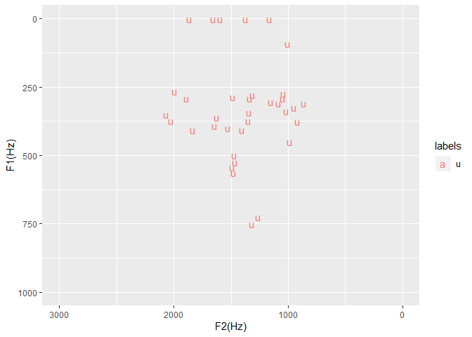

```r
# Point working directory to a folder where there are TextGrid and wav files (usually from forced alignment)
knitr::opts_knit$set(root.dir = "C:\\Users\\Tim\\Documents\\Kera_NT\\original_data_for_paper_including_converted_mp3\\just_narrator")
```


```r
library(emuR)
```

```
## 
## Attaching package: 'emuR'
```

```
## The following object is masked from 'package:base':
## 
##     norm
```

```r
library(ggplot2)
library(dplyr)
```

```
## 
## Attaching package: 'dplyr'
```

```
## The following objects are masked from 'package:stats':
## 
##     filter, lag
```

```
## The following objects are masked from 'package:base':
## 
##     intersect, setdiff, setequal, union
```


```r
# Set up database
path2directory = file.path(getwd())
convert_TextGridCollection(path2directory, dbName = "actor", targetDir = tempdir())
```

```
## INFO: Loading TextGridCollection containing 4 file pairs...
## 
  |                                                                       
  |                                                                 |   0%
  |                                                                       
  |================                                                 |  25%
  |                                                                       
  |================================                                 |  50%
  |                                                                       
  |=================================================                |  75%
  |                                                                       
  |=================================================================| 100%
##   INFO: Rewriting 4 _annot.json files to file system...
## 
  |                                                                       
  |                                                                 |   0%
  |                                                                       
  |================                                                 |  25%
  |                                                                       
  |================================                                 |  50%
  |                                                                       
  |=================================================                |  75%
  |                                                                       
  |=================================================================| 100%
```

```r
path2db = file.path(tempdir(), "actor_emuDB")
db_handle = load_emuDB(path2db, verbose = FALSE)
# Set up word tier and phone tier
autobuild_linkFromTimes(db_handle, superlevelName = "word", sublevelName = "phone", convertSuperlevel = TRUE, newLinkDefType = "ONE_TO_MANY")
```

```
##   INFO: Rewriting 4 _annot.json files to file system...
## 
  |                                                                       
  |                                                                 |   0%
  |                                                                       
  |================                                                 |  25%
  |                                                                       
  |================================                                 |  50%
  |                                                                       
  |=================================================                |  75%
  |                                                                       
  |=================================================================| 100%
```

```r
features <- read.table("big_hayes_phone_list_utf8nfc.tsv",sep="\t", header=TRUE,encoding="UTF-8")
```


```r
## Define the phoneList function
phoneList <- function(type,value=NULL)
{
  # Function `phoneList` (c) Dave Lovell
  ## Produces a character vector of phones based on the class specified by the input which is a string
  ## Eg.  phoneList('delayed_release',-1)
  
  #Catch bad values ----------------------------------------------------------------------
  if(!is.null(value)&&!(value %in% c(F,T,1,0,-1)))  {stop('Unrecognised \'value\' argument (should be T/F or [-1:1])')}
  if(!(type %in% colnames(features)))               {stop('\'Type\' argument not in colnames(features)')}
  
  # Generate character vector ------------------------------------------------------------
  if(!is.null(value)&is.numeric(value))
    { return(as.vector(features$BruceHayes2007[features[[type]]==value]))
    } else {stop('integer \'value\' argument required with this phoneme type')}
}
```


```r
# Get a list of IPA non_high_vowels
vowels <- phoneList('syllabic',1)
non_high_phones <- phoneList('high',-1)
non_high_vowel_intersection <- intersect(vowels, non_high_phones)
```


```r
# Define an EMU label group called non_high_vowel
add_attrDefLabelGroup(db_handle,levelName = "phone",attributeDefinitionName = "phone",labelGroupName = "non_high_vowel", labelGroupValues = non_high_vowel_intersection)
```


```r
# This section finds all the high vowel harmony words.
# First get words with a non high vowel
words_with_non_high_vowel <- query(db_handle, query = "[word =~ .* ^ phone == non_high_vowel]")
```


```r
# Get a big list of all corresponding phones for those non vowel harmony words - you'll get a warning that it's bigger list
normal_phones <- requery_hier(db_handle,seglist = words_with_non_high_vowel, level = "phone", collapse = FALSE)
```

```
## Warning in requery_hier(db_handle, seglist = words_with_non_high_vowel, :
## Length of requery segment list (4210) differs from input list (1083)!
```


```r
# Get all the u vowels that were found in the normal (non-high-vowel-harmony) domain 
u_vowel_normal_words <- normal_phones[normal_phones$labels=="u", ]
u_long_vowel_normal_words <- normal_phones[normal_phones$labels=="uː", ]
# put them both together
u_all_vowel_normal_words <- rbind(u_vowel_normal_words, u_long_vowel_normal_words)
# just extract the short ones
short_u_all_vowel_normal_words <- u_all_vowel_normal_words[((u_all_vowel_normal_words$end - u_all_vowel_normal_words$start) < 50), ]
seglist_in <- short_u_all_vowel_normal_words
```


```r
# Calculate formants
trackdata = get_trackdata(db_handle,
                          seglist = seglist_in,
                          onTheFlyFunctionName = "forest",
                          resultType = "tibble",
                          verbose = F)
# Get midpoint of trackdata so we just use the formant values at the midpoint
trackdata_norm=normalize_length(trackdata)
trackdata_norm_midpoint = trackdata_norm %>% filter(times_norm > 0.49 & times_norm < 0.51)
# check size - this should match the number of records in seglist_in
dim(trackdata_norm_midpoint)
```

```
## [1] 37 24
```


```r
# Print out statistical summary (I'm most interested
# in T1 and T2 which corresponds to F1 and F2)
summary(trackdata_norm_midpoint)
```

```
##    sl_rowIdx     labels              start             end        
##  Min.   : 1   Length:37          Min.   :  3575   Min.   :  3605  
##  1st Qu.:10   Class :character   1st Qu.: 95880   1st Qu.: 95910  
##  Median :19   Mode  :character   Median :151850   Median :151880  
##  Mean   :19                      Mean   :192268   Mean   :192304  
##  3rd Qu.:28                      3rd Qu.:278746   3rd Qu.:278776  
##  Max.   :37                      Max.   :478343   Max.   :478373  
##    db_uuid            session             bundle          start_item_id 
##  Length:37          Length:37          Length:37          Min.   : 430  
##  Class :character   Class :character   Class :character   1st Qu.: 979  
##  Mode  :character   Mode  :character   Mode  :character   Median :1736  
##                                                           Mean   :1880  
##                                                           3rd Qu.:2503  
##                                                           Max.   :3934  
##   end_item_id      level            attribute         start_item_seq_idx
##  Min.   : 430   Length:37          Length:37          Min.   :   6      
##  1st Qu.: 979   Class :character   Class :character   1st Qu.: 431      
##  Median :1736   Mode  :character   Mode  :character   Median : 793      
##  Mean   :1880                                         Mean   :1124      
##  3rd Qu.:2503                                         3rd Qu.:1529      
##  Max.   :3934                                         Max.   :2960      
##  end_item_seq_idx     type            sample_start        sample_end      
##  Min.   :   6     Length:37          Min.   :  157657   Min.   :  158979  
##  1st Qu.: 431     Class :character   1st Qu.: 4228308   1st Qu.: 4229630  
##  Median : 793     Mode  :character   Median : 6696585   Median : 6697907  
##  Mean   :1124                        Mean   : 8479037   Mean   : 8480586  
##  3rd Qu.:1529                        3rd Qu.:12292698   3rd Qu.:12294020  
##  Max.   :2960                        Max.   :21094926   Max.   :21096248  
##   sample_rate      times_orig       times_rel       times_norm 
##  Min.   :44100   Min.   :  3590   Min.   :15.00   Min.   :0.5  
##  1st Qu.:44100   1st Qu.: 95895   1st Qu.:15.00   1st Qu.:0.5  
##  Median :44100   Median :151865   Median :15.00   Median :0.5  
##  Mean   :44100   Mean   :192286   Mean   :17.57   Mean   :0.5  
##  3rd Qu.:44100   3rd Qu.:278761   3rd Qu.:20.00   3rd Qu.:0.5  
##  Max.   :44100   Max.   :478358   Max.   :25.00   Max.   :0.5  
##        T1               T2             T3             T4      
##  Min.   :   0.0   Min.   : 863   Min.   :   0   Min.   :1498  
##  1st Qu.: 284.0   1st Qu.:1152   1st Qu.:2400   1st Qu.:3540  
##  Median : 340.5   Median :1407   Median :2518   Median :3764  
##  Mean   : 373.4   Mean   :1437   Mean   :2339   Mean   :3620  
##  3rd Qu.: 404.5   3rd Qu.:1646   3rd Qu.:2626   3rd Qu.:3856  
##  Max.   :1204.0   Max.   :2094   Max.   :3386   Max.   :4280
```


```r
#Plot on a formant chart
trackdata_norm_midpoint %>%
    filter((end - start)>0) %>%
    ggplot(aes(x=T2,y=T1,color=labels))+
    geom_text(aes(label = labels))+
    xlim(3000, 0)+ylim(1000,0)+xlab("F2(Hz)")+ylab("F1(Hz)")
```

```
## Warning: Removed 2 rows containing missing values (geom_text).
```

<!-- -->
