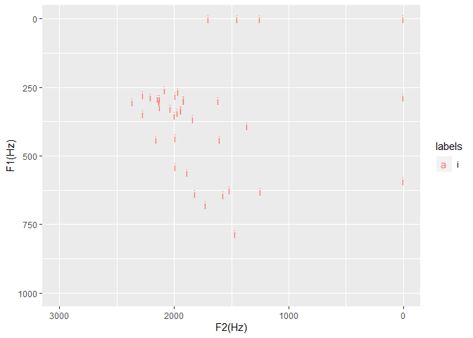

```r
# Point working directory to a folder where there are TextGrid and wav files (usually from forced alignment)
knitr::opts_knit$set(root.dir = "C:\\Users\\Tim\\Documents\\Kera_NT\\original_data_for_paper_including_converted_mp3\\just_narrator")
```


```r
library(emuR)
```

```
## 
## Attaching package: 'emuR'
```

```
## The following object is masked from 'package:base':
## 
##     norm
```

```r
library(ggplot2)
library(dplyr)
```

```
## 
## Attaching package: 'dplyr'
```

```
## The following objects are masked from 'package:stats':
## 
##     filter, lag
```

```
## The following objects are masked from 'package:base':
## 
##     intersect, setdiff, setequal, union
```


```r
# Set up database
path2directory = file.path(getwd())
convert_TextGridCollection(path2directory, dbName = "actor", targetDir = tempdir())
```

```
## INFO: Loading TextGridCollection containing 4 file pairs...
## 
  |                                                                       
  |                                                                 |   0%
  |                                                                       
  |================                                                 |  25%
  |                                                                       
  |================================                                 |  50%
  |                                                                       
  |=================================================                |  75%
  |                                                                       
  |=================================================================| 100%
##   INFO: Rewriting 4 _annot.json files to file system...
## 
  |                                                                       
  |                                                                 |   0%
  |                                                                       
  |================                                                 |  25%
  |                                                                       
  |================================                                 |  50%
  |                                                                       
  |=================================================                |  75%
  |                                                                       
  |=================================================================| 100%
```

```r
path2db = file.path(tempdir(), "actor_emuDB")
db_handle = load_emuDB(path2db, verbose = FALSE)
# Set up word tier and phone tier
autobuild_linkFromTimes(db_handle, superlevelName = "word", sublevelName = "phone", convertSuperlevel = TRUE, newLinkDefType = "ONE_TO_MANY")
```

```
##   INFO: Rewriting 4 _annot.json files to file system...
## 
  |                                                                       
  |                                                                 |   0%
  |                                                                       
  |================                                                 |  25%
  |                                                                       
  |================================                                 |  50%
  |                                                                       
  |=================================================                |  75%
  |                                                                       
  |=================================================================| 100%
```

```r
features <- read.table("big_hayes_phone_list_utf8nfc.tsv",sep="\t", header=TRUE,encoding="UTF-8")
```


```r
## Define the phoneList function
phoneList <- function(type,value=NULL)
{
  # Function `phoneList` (c) Dave Lovell
  ## Produces a character vector of phones based on the class specified by the input which is a string
  ## Eg.  phoneList('delayed_release',-1)
  
  #Catch bad values ----------------------------------------------------------------------
  if(!is.null(value)&&!(value %in% c(F,T,1,0,-1)))  {stop('Unrecognised \'value\' argument (should be T/F or [-1:1])')}
  if(!(type %in% colnames(features)))               {stop('\'Type\' argument not in colnames(features)')}
  
  # Generate character vector ------------------------------------------------------------
  if(!is.null(value)&is.numeric(value))
    { return(as.vector(features$BruceHayes2007[features[[type]]==value]))
    } else {stop('integer \'value\' argument required with this phoneme type')}
}
```


```r
# Get a list of IPA non_high_vowels
vowels <- phoneList('syllabic',1)
non_high_phones <- phoneList('high',-1)
non_high_vowel_intersection <- intersect(vowels, non_high_phones)
```


```r
# Define an EMU label group called non_high_vowel
add_attrDefLabelGroup(db_handle,levelName = "phone",attributeDefinitionName = "phone",labelGroupName = "non_high_vowel", labelGroupValues = non_high_vowel_intersection)
```


```r
# This section finds all the high vowel harmony words.
# First get words with a non high vowel
words_with_non_high_vowel <- query(db_handle, query = "[word =~ .* ^ phone == non_high_vowel]")
```


```r
# Get a big list of all corresponding phones for those non vowel harmony words - you'll get a warning that it's bigger list
normal_phones <- requery_hier(db_handle,seglist = words_with_non_high_vowel, level = "phone", collapse = FALSE)
```

```
## Warning in requery_hier(db_handle, seglist = words_with_non_high_vowel, :
## Length of requery segment list (4210) differs from input list (1083)!
```


```r
# Get all the i vowels that were found in the normal (non-high-vowel-harmony) domain 
i_vowel_normal_words <- normal_phones[normal_phones$labels=="i", ]
i_long_vowel_normal_words <- normal_phones[normal_phones$labels=="iː", ]
# put them both together
i_all_vowel_normal_words <- rbind(i_vowel_normal_words, i_long_vowel_normal_words)
# just extract the short ones
short_i_all_vowel_normal_words <- i_all_vowel_normal_words[((i_all_vowel_normal_words$end - i_all_vowel_normal_words$start) < 50), ]
seglist_in <- short_i_all_vowel_normal_words
```


```r
# Calculate formants
trackdata = get_trackdata(db_handle,
                          seglist = seglist_in,
                          onTheFlyFunctionName = "forest",
                          resultType = "tibble",
                          verbose = F)
# Get midpoint of trackdata so we just use the formant values at the midpoint
trackdata_norm=normalize_length(trackdata)
trackdata_norm_midpoint = trackdata_norm %>% filter(times_norm > 0.49 & times_norm < 0.51)
# check size - this should match the number of records in seglist_in
dim(trackdata_norm_midpoint)
```

```
## [1] 38 24
```


```r
# Print out statistical summary (I'm most interested
# in T1 and T2 which corresponds to F1 and F2)
summary(trackdata_norm_midpoint)
```

```
##    sl_rowIdx        labels              start             end        
##  Min.   : 1.00   Length:38          Min.   :  6255   Min.   :  6295  
##  1st Qu.:10.25   Class :character   1st Qu.:101065   1st Qu.:101095  
##  Median :19.50   Mode  :character   Median :208903   Median :208938  
##  Mean   :19.50                      Mean   :194701   Mean   :194735  
##  3rd Qu.:28.75                      3rd Qu.:283353   3rd Qu.:283391  
##  Max.   :38.00                      Max.   :410445   Max.   :410485  
##    db_uuid            session             bundle          start_item_id   
##  Length:38          Length:38          Length:38          Min.   : 473.0  
##  Class :character   Class :character   Class :character   1st Qu.: 983.5  
##  Mode  :character   Mode  :character   Mode  :character   Median :1862.5  
##                                                           Mean   :1880.3  
##                                                           3rd Qu.:2451.5  
##                                                           Max.   :3678.0  
##   end_item_id        level            attribute         start_item_seq_idx
##  Min.   : 473.0   Length:38          Length:38          Min.   :  47.0    
##  1st Qu.: 983.5   Class :character   Class :character   1st Qu.: 548.5    
##  Median :1862.5   Mode  :character   Mode  :character   Median :1292.0    
##  Mean   :1880.3                                         Mean   :1184.4    
##  3rd Qu.:2451.5                                         3rd Qu.:1659.2    
##  Max.   :3678.0                                         Max.   :2704.0    
##  end_item_seq_idx     type            sample_start        sample_end      
##  Min.   :  47.0   Length:38          Min.   :  275845   Min.   :  277608  
##  1st Qu.: 548.5   Class :character   1st Qu.: 4456977   1st Qu.: 4458299  
##  Median :1292.0   Mode  :character   Median : 9212622   Median : 9214164  
##  Mean   :1184.4                      Mean   : 8586331   Mean   : 8587792  
##  3rd Qu.:1659.2                      3rd Qu.:12495878   3rd Qu.:12497530  
##  Max.   :2704.0                      Max.   :18100624   Max.   :18102387  
##   sample_rate      times_orig       times_rel       times_norm 
##  Min.   :44100   Min.   :  6275   Min.   :15.00   Min.   :0.5  
##  1st Qu.:44100   1st Qu.:101080   1st Qu.:15.00   1st Qu.:0.5  
##  Median :44100   Median :208921   Median :15.00   Median :0.5  
##  Mean   :44100   Mean   :194718   Mean   :16.58   Mean   :0.5  
##  3rd Qu.:44100   3rd Qu.:283372   3rd Qu.:20.00   3rd Qu.:0.5  
##  Max.   :44100   Max.   :410465   Max.   :25.00   Max.   :0.5  
##        T1              T2             T3             T4      
##  Min.   :  0.0   Min.   :   0   Min.   :   0   Min.   :   0  
##  1st Qu.:285.5   1st Qu.:1580   1st Qu.:2481   1st Qu.:3530  
##  Median :328.0   Median :1925   Median :2582   Median :3664  
##  Mean   :363.6   Mean   :1724   Mean   :2492   Mean   :3315  
##  3rd Qu.:439.2   3rd Qu.:2068   3rd Qu.:2812   3rd Qu.:3791  
##  Max.   :784.0   Max.   :2362   Max.   :3114   Max.   :4156
```


```r
#Plot on a formant chart
trackdata_norm_midpoint %>%
    filter((end - start)>0) %>%
    ggplot(aes(x=T2,y=T1,color=labels))+
    geom_text(aes(label = labels))+
    xlim(3000, 0)+ylim(1000,0)+xlab("F2(Hz)")+ylab("F1(Hz)")
```

<!-- -->
